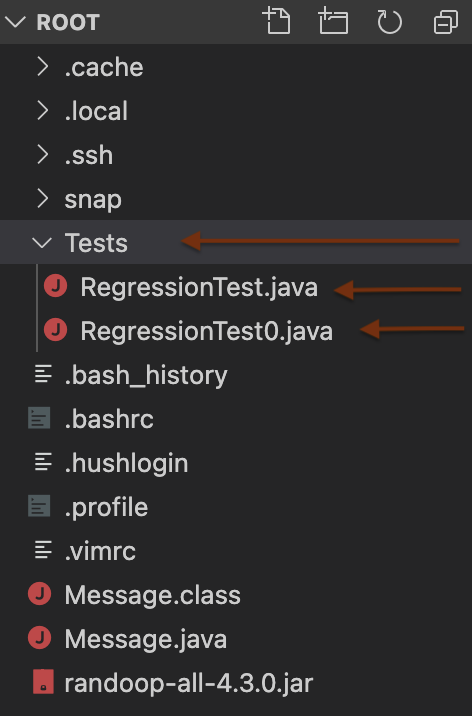

# Lets see what was generated
The gererated test files is listed under the "Tests" directory which can be found on visual studio code. 

After running the commands all test cases of the Message.class file would be listed in the new Java files which is generated by Randoop named RegressionTest, RegressionTest0.

